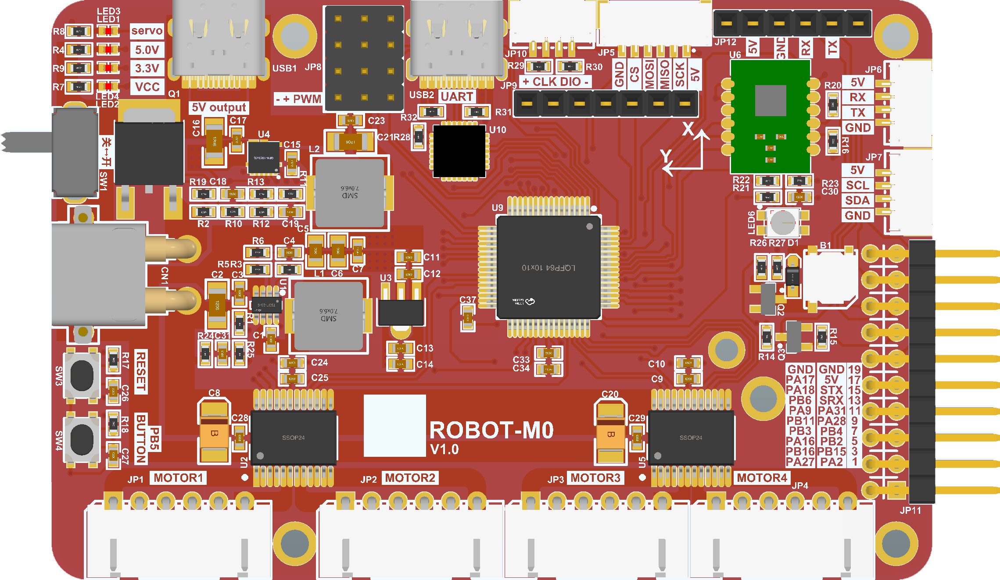

# ros2car_mspm0

This is a project designed for Ti MSPM0G3507 DC motor car driver board.

## feature

* Texas Instrument MSPM0G3507 Microcontroller.
* TB6612FNG DC motor driver IC support.
* ICM42688-P IMU (inertial measurement unit).
* PWM servo driver x4 support.
* RGB LED support.
* Buzzer support.
* External 0.96/1.3inch 7P OLED support.
* External bluetooth module support.
* System DC-DC power supply with 5-12V input and 5V/6A output.
* Servo DC-DC power supply with 5-12V input and 5V/6A output.

## build

## user guide

## todo

